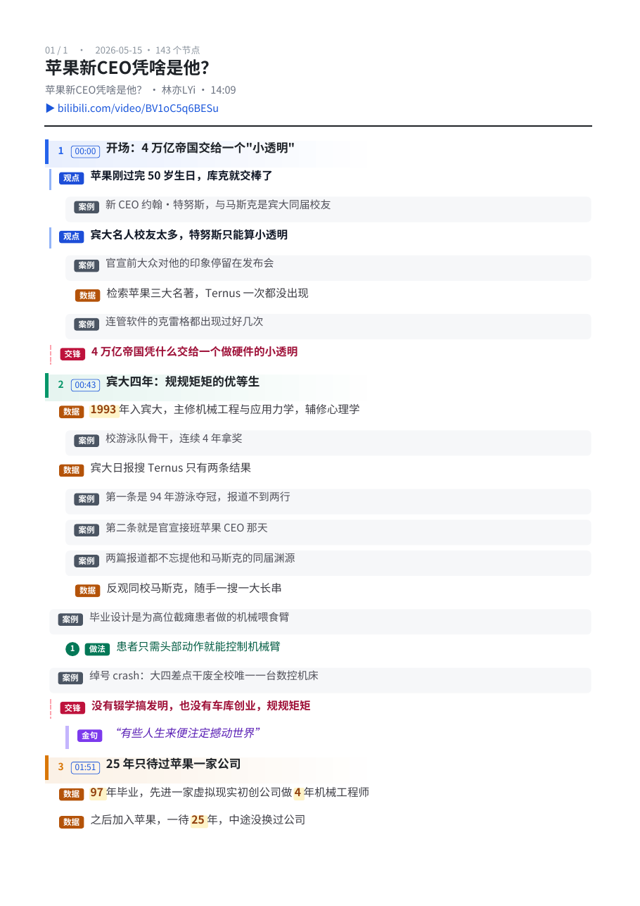
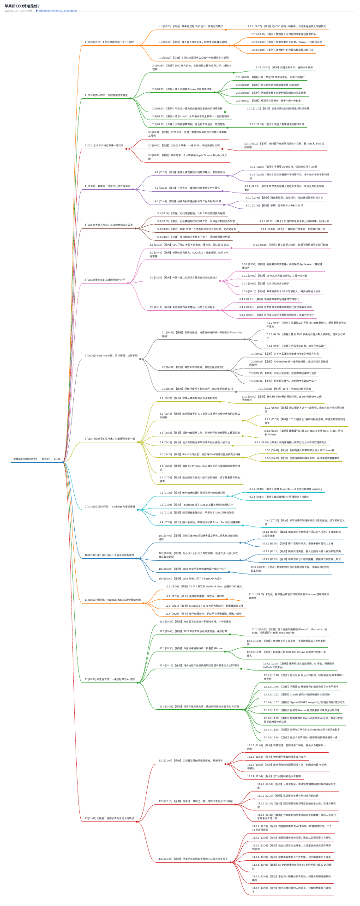
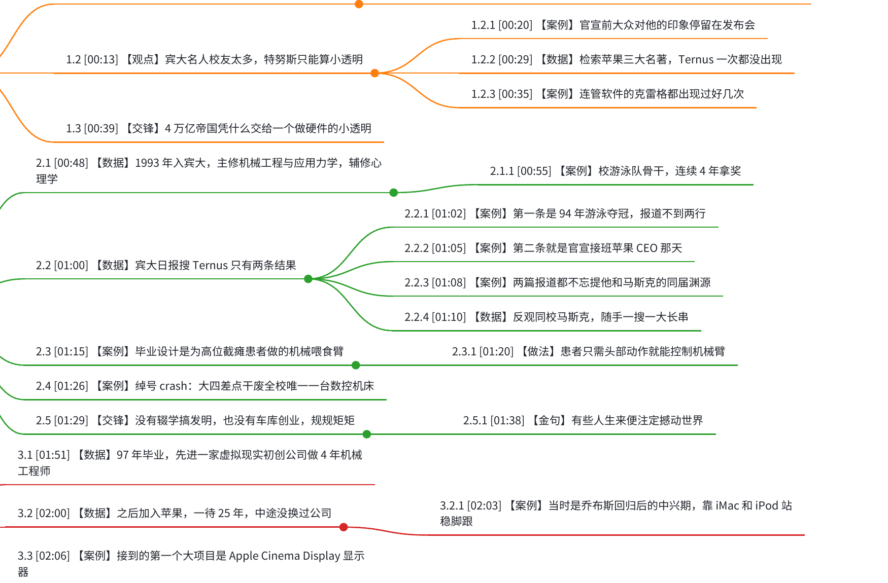

# bili-skill

[](LICENSE)
[](https://docs.claude.com/en/docs/claude-code/skills)
[](#装)
[](SKILL.md)
[](#需要准备什么)

**中文** | [English](README.en.md)

## 把 B 站视频变成能读、能搜、能存的东西

收藏夹里那一排「稍后再看」，你我都清楚——不会再看了。
而真正看完的那些也留不下什么：想引用某句话得拖三遍进度条，随手截的图一个字都搜不出来。
**视频是这个时代信息密度最高的载体，也是最难被检索的那一个。**

一个 Agent Skill，装进 Claude Code（或 Cursor / Codex / Gemini CLI 等 50+ 个工具），
然后用说话的方式使唤它——不用记命令。



上面这张是一期 14 分钟的视频跑完之后的成品：13 节、143 个信息点，
`观点` `数据` `案例` `金句` `做法` `交锋` 六种标签各有颜色，每个时间戳点一下跳回原视频那一秒。

---

## 一期视频进去，出来这么一条链

样本：[《苹果新CEO凭啥是他？》](https://www.bilibili.com/video/BV1oC5q6BESu) ·
UP 主 林亦LYi · 14:09 · 105 万播放
（下面这些文件都在 [`examples/`](examples/) 里，点开就能看，不用装任何东西）

### ① 官方 AI 字幕 → ② 能读的文章

B 站给的是这个，给播放器打轴用的，两秒一断、没标点：

```srt
1
00:00:00,240 --> 00:00:01,760
苹果刚过完50岁生日

2
00:00:01,760 --> 00:00:02,720
库克就下车了
```

它给你的是这个：

```markdown
# 苹果新CEO凭啥是他？

> 全文时长约 13:59 · 共 43 段 · 时间戳为该段起始位置

---

**`[00:00]`** 苹果刚过完50岁生日库克就下车了新上任的苹果CEO呢名字叫john turner约翰特努斯
他还是马斯克的宾大同届校友说到宾大呢哇那他的优秀毕业生可就太多了…

**`[00:20]`** 咱们对特努斯的印象大多停留在发布会上这次呢为了深入了解这哥们我又温习了一下
苹果三大名著检索关键词turn他的名字都没出现过…
```

**29 KB 碎字幕 → 15 KB、43 段的读物。** 十四分钟的内容两分钟扫完。
每段的时间戳是留给你回头核对的，觉得哪句有意思，照着 `[00:20]` 跳回去听原话。

### ③ 文章 → 带标签的大纲

不是摘要，是把讲者的论点和撑住它的论据拆开、对上号：

```markdown
## 2. `[00:43]` 宾大四年：规规矩矩的优等生

- **数据** 1993 年入宾大，主修机械工程与应用力学，辅修心理学
  - *案例* 校游泳队骨干，连续 4 年拿奖
- **数据** 宾大日报搜 Ternus 只有两条结果
  - *案例* 第一条是 94 年游泳夺冠，报道不到两行
  - *案例* 第二条就是官宣接班苹果 CEO 那天
  - **数据** 反观同校马斯克，随手一搜一大长串
- *案例* 绰号 crash：大四差点干废全校唯一一台数控机床
- **交锋** 没有辍学搞发明，也没有车库创业，规规矩矩
  - > "有些人生来便注定撼动世界"
```

六种标签，按每条**实际是什么**来打：

| `观点` | `数据` | `案例` | `金句` | `做法` | `交锋` |
|---|---|---|---|---|---|
| 主张、判断、结论 | 数字、比例、规模 | 故事、亲身经历 | 值得引用的原话 | 步骤、建议、方法 | 提问与回应、分歧 |

**扫一眼就知道哪句是结论、哪句是撑住它的证据。** 这期 14 分钟的视频拆出了 143 个信息点。

### ④ 大纲 → 脑图 + PDF



整期铺一页，页面尺寸按内容自适应，不切页、不挤字。放大之后：



矢量排版放多大都不糊，PDF 里的中文**可搜索、可复制**。
脑图同时出一份 `.opml`，能直接拖进 XMind、MindNode、幕布、Freeplane。
多期一起跑的话，脑图合一本 PDF、大纲合一本。

---

## 你说 / 你得到

| 你说 | 你得到 |
|---|---|
| 「把这个 B 站视频下下来」 | mp4 + 封面 + 播放点赞等信息 |
| 「整理成一篇能读的文章」 | 带时间戳的 Markdown |
| 「这几期做成脑图和 PDF」 | 大纲 + OPML + 两本可搜索 PDF |
| 「顺便把视频也下了」 | 上面两条一起 |
| 「检查一下环境」 | 缺什么、该敲哪条命令 |

**要文字不必先下视频**——字幕是直接从接口取的，几十秒，不占硬盘。
一次给多个链接就是批量；已经做好的它会认，不重复干活，中间断了也能接着跑。

### 产出的文件长什么样

```
科技合集/
├── BV1oC5q6BESu.mp4                                       正片
├── BV1oC5q6BESu.jpg                                       封面
├── BV1oC5q6BESu.info.json                                 标题/时长/播放/点赞/UP主
├── 20260515-苹果新CEO凭啥是他？-BV1oC5q6BESu.srt            原始字幕
├── 20260515-苹果新CEO凭啥是他？-BV1oC5q6BESu-阅读版.md       能读的文章
├── 20260515-苹果新CEO凭啥是他？-BV1oC5q6BESu-大纲.md         带标签的大纲
├── 20260515-苹果新CEO凭啥是他？-BV1oC5q6BESu.opml            脑图
├── 科技合集-mindmap.pdf                                    整批合一本
└── 科技合集-outline.pdf                                    整批合一本
```

文件名带日期和标题，三个月后翻文件夹也认得出是哪期。

`info.json` 的真实内容：

```json
{
  "bvid": "BV1oC5q6BESu",
  "title": "苹果新CEO凭啥是他？",
  "owner": "林亦LYi",
  "duration": 849,
  "view": 1050422,
  "like": 26260,
  "desc": "特努斯是谁？他会带苹果走向何方？",
  "url": "https://www.bilibili.com/video/BV1oC5q6BESu"
}
```

视频哪天下架了，标题和你存它那天的数据还在你手上。

---

## 装

把这句话发给你的 AI——

> 帮我把 https://github.com/xykong36/bili-skill 装成 skill

装完直接说话，不用配置。

---

## 需要准备什么

| 你要做什么 | 需要装 |
|---|---|
| 文字 / 文章 / 大纲 / 脑图 | **什么都不用装** |
| 下载视频 | [BBDown](https://github.com/nilaoda/BBDown/releases) + ffmpeg（`brew install ffmpeg`） |
| 出 PDF | `pip install fpdf2 fonttools` |
| 第一次取字幕 | `pip install segno`，扫码登录 B 站（一次就够） |

Python 3.9+。不确定就跟它说「检查一下环境」，缺什么它告诉你敲哪条命令。

---

## 要花钱吗？会动我的账号吗？

**不花钱。** 整理大纲那步默认由你正在用的那个 AI 完成，不额外调接口——你已经在付的订阅就够了。
（想让它整批无人值守地跑，也可以配个 API key，可选。）

**账号只读。** 扫码登录只为取字幕——没登录的时候 B 站会假装「这个视频没有字幕」。
登录信息存在你自己电脑上，已排除在版本控制之外。
这个工具只跟 B 站通信，不会替你点赞、评论、投币。

---

## 它做不了什么

- **没有官方 AI 字幕的视频整理不了**——它不做语音转录，遇到会直接告诉你跳过了哪期，不硬编文稿。
- **不做整个 UP 主空间的批量抓取**，它是给单期或少量几期设计的，不是爬虫。
- **只认 B 站。**
- **文章不改字**：底稿是 B 站的 AI 字幕，本身带识别错误（上面那段里的「john turner」就是），这个工具只做合并排版。时间戳就是留给你核对的。

---

想改它、或者想看它完整的行为规则：[SKILL.md](SKILL.md)
和 [references/](references/)。

`examples/` 里的文字产物只放了开头节选，版权归原作者
[林亦LYi](https://space.bilibili.com/4401694)——想看完整内容请去
[B 站](https://www.bilibili.com/video/BV1oC5q6BESu)看，顺手点个赞。

## 许可

代码 MIT（见 [LICENSE](LICENSE)）。
内置的 `NotoSansSC.ttf` 按 SIL Open Font License 1.1 分发，许可证副本在字体旁边的 `OFL.txt`。
